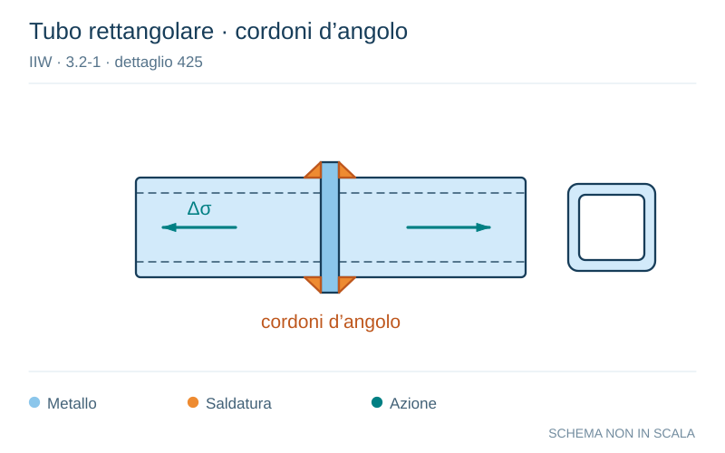

# IIW · 3.2-1 · dettaglio 425

[Pagina estratta](../pages/iiw-063.md) · [PDF originale](../../sources/iiw.pdf#page=63)

**Tubo rettangolare · cordoni d’angolo.** Disegno vettoriale non in scala. [Apri / scarica il disegno SVG](../../assets/illustrations/iiw-063-t01-d03.svg).

Il blu rappresenta gli elementi metallici, l’arancio le saldature e il turchese le azioni. Simboli e proporzioni hanno funzione schematica; classi, dimensioni limite e condizioni applicabili sono quelle riportate nella fonte.

## Classificazione riportata

steel: 40
36; aluminium: 16
14

## Descrizione e condizioni

Splice of rectangular hollow section
with intermediate plate, fillet welds,
root crack
        wall thickness > 8 mm
        wall thickness < 8 mm

## Requisiti e note

> Estrazione documentale da verificare. Le categorie non sono valori di progetto pronti per il calcolo. Celle condivise e varianti non vanno separate dalle condizioni.

## Contesto della classificazione

[Celle della tabella in Markdown](../tables/iiw-063-t01.md) · [Tabella nel PDF di riferimento](../../sources/iiw.pdf#page=63).
