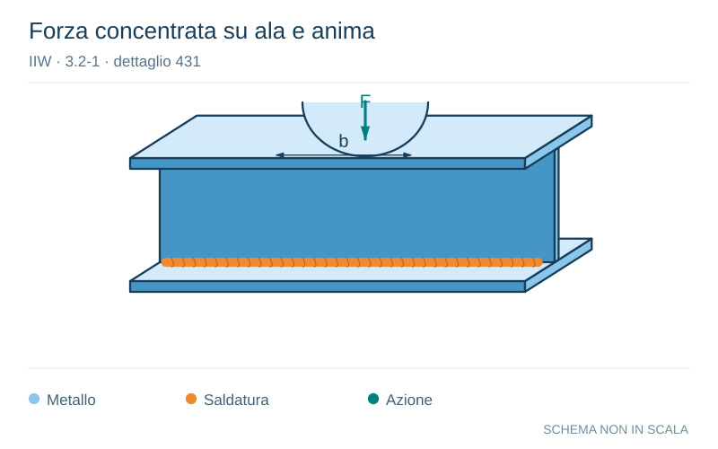

# IIW · 3.2-1 · dettaglio 431

[Pagina estratta](../pages/iiw-064.md) · [PDF originale](../../sources/iiw.pdf#page=64)

**Forza concentrata su ala e anima.** Disegno vettoriale non in scala. [Apri / scarica il disegno SVG](../../assets/illustrations/iiw-064-t01-d01.svg).

Il blu rappresenta gli elementi metallici, l’arancio le saldature e il turchese le azioni. Simboli e proporzioni hanno funzione schematica; classi, dimensioni limite e condizioni applicabili sono quelle riportate nella fonte.

## Classificazione riportata

steel: ---; aluminium: ---

## Descrizione e condizioni

Weld connecting web and flange, loa-
ded by a concentrated force in web pla-
ne perpendicular to weld. Force distri-
buted on width b = 2Ah + 50 mm.
Assessment according to no. 411 - 414.
A local bending due to eccentric load
should be considered.

## Requisiti e note

Full penetration butt weld.

> Estrazione documentale da verificare. Le categorie non sono valori di progetto pronti per il calcolo. Celle condivise e varianti non vanno separate dalle condizioni.

## Contesto della classificazione

[Celle della tabella in Markdown](../tables/iiw-064-t01.md) · [Tabella nel PDF di riferimento](../../sources/iiw.pdf#page=64).
