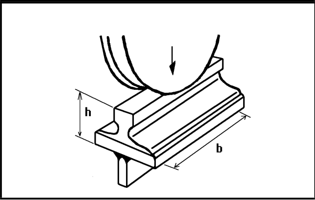

# IIW · 3.2-1 · dettaglio 431

[Pagina estratta](../pages/iiw-064.md) · [PDF originale](../../sources/iiw.pdf#page=64)

## Classificazione riportata

steel: ---; aluminium: ---

## Descrizione e condizioni

Weld connecting web and flange, loa-
ded by a concentrated force in web pla-
ne perpendicular to weld. Force distri-
buted on width b = 2Ah + 50 mm.
Assessment according to no. 411 - 414.
A local bending due to eccentric load
should be considered.

## Requisiti e note

Full penetration butt weld.

> Estrazione documentale da verificare. Le categorie non sono valori di progetto pronti per il calcolo. Celle condivise e varianti non vanno separate dalle condizioni.

## Tabella completa

