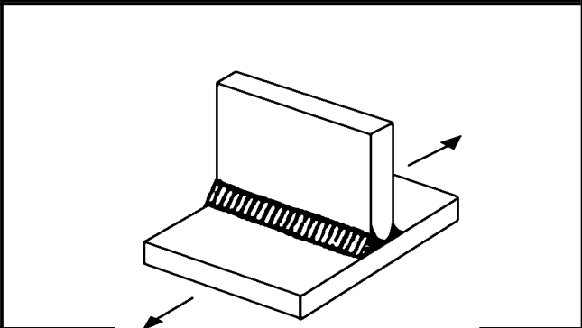
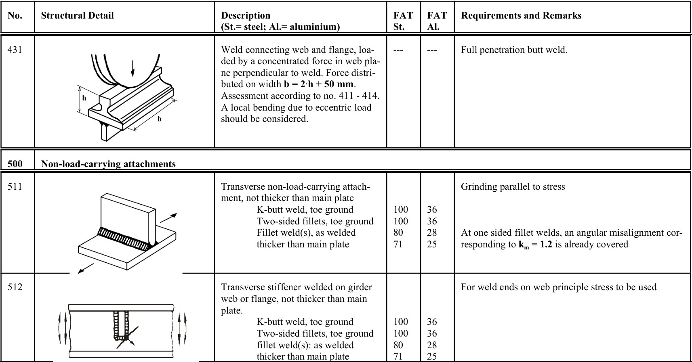

# IIW · 3.2-1 · dettaglio 511

[Pagina estratta](../pages/iiw-064.md) · [PDF originale](../../sources/iiw.pdf#page=64)

## Classificazione riportata

steel: 100
100
80
71; aluminium: 36
36
28
25

## Descrizione e condizioni

Transverse non-load-carrying attach-
ment, not thicker than main plate
        K-butt weld, toe ground
       Two-sided fillets, toe ground
          Fillet weld(s), as welded
         thicker than main plate

## Requisiti e note

Grinding parallel to stress

At one sided fillet welds, an angular misalignment cor-
responding to km = 1.2 is already covered

> Estrazione documentale da verificare. Le categorie non sono valori di progetto pronti per il calcolo. Celle condivise e varianti non vanno separate dalle condizioni.

## Tabella completa

