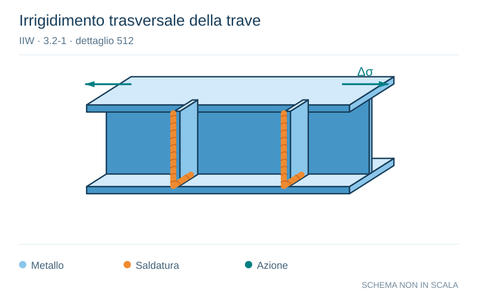

# IIW · 3.2-1 · dettaglio 512

[Pagina estratta](../pages/iiw-064.md) · [PDF originale](../../sources/iiw.pdf#page=64)

**Irrigidimento trasversale della trave.** Disegno vettoriale non in scala. [Apri / scarica il disegno SVG](../../assets/illustrations/iiw-064-t01-d03.svg).

Il blu rappresenta gli elementi metallici, l’arancio le saldature e il turchese le azioni. Simboli e proporzioni hanno funzione schematica; classi, dimensioni limite e condizioni applicabili sono quelle riportate nella fonte.

## Classificazione riportata

steel: 100
100
80
71; aluminium: 36
36
28
25

## Descrizione e condizioni

Transverse stiffener welded on girder
web or flange, not thicker than main
plate.
        K-butt weld, toe ground
       Two-sided fillets, toe ground
           fillet weld(s): as welded
         thicker than main plate

## Requisiti e note

For weld ends on web principle stress to be used

> Estrazione documentale da verificare. Le categorie non sono valori di progetto pronti per il calcolo. Celle condivise e varianti non vanno separate dalle condizioni.

## Contesto della classificazione

[Celle della tabella in Markdown](../tables/iiw-064-t01.md) · [Tabella nel PDF di riferimento](../../sources/iiw.pdf#page=64).
