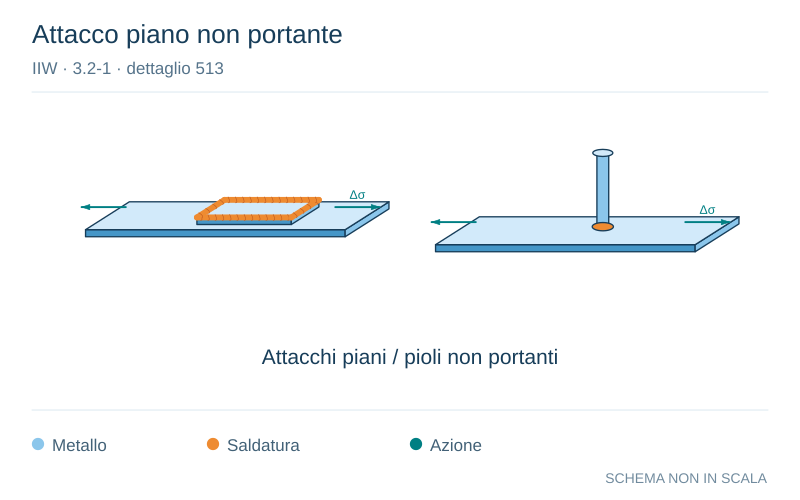

# IIW · 3.2-1 · dettaglio 513

[Pagina estratta](../pages/iiw-065.md) · [PDF originale](../../sources/iiw.pdf#page=65)

**Attacco piano non portante.** Disegno vettoriale non in scala. [Apri / scarica il disegno SVG](../../assets/illustrations/iiw-065-t01-d01.svg).

Il blu rappresenta gli elementi metallici, l’arancio le saldature e il turchese le azioni. Simboli e proporzioni hanno funzione schematica; classi, dimensioni limite e condizioni applicabili sono quelle riportate nella fonte.

## Classificazione riportata

steel: 80
71
63
50; aluminium: 28
25
20
18

## Descrizione e condizioni

Non-loadcarrying rectangular or circu-
lar flat attachments or studs
Non-loadcarrying studs, as welded

L # 50 mm
L >50 and # 150 mm
L >150 and # 300 mm
L > 300 mm

## Requisiti e note

> Estrazione documentale da verificare. Le categorie non sono valori di progetto pronti per il calcolo. Celle condivise e varianti non vanno separate dalle condizioni.

## Contesto della classificazione

[Celle della tabella in Markdown](../tables/iiw-065-t01.md) · [Tabella nel PDF di riferimento](../../sources/iiw.pdf#page=65).
