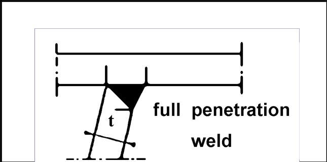

# IIW · 3.2-1 · dettaglio 514

[Pagina estratta](../pages/iiw-065.md) · [PDF originale](../../sources/iiw.pdf#page=65)

## Classificazione riportata

steel: 71; aluminium: 25

## Descrizione e condizioni

Trapezoidal stiffener to deck plate, full
penetration butt weld, calculated on
basis of stiffener thickness, out of plane
bending

## Requisiti e note

> Estrazione documentale da verificare. Le categorie non sono valori di progetto pronti per il calcolo. Celle condivise e varianti non vanno separate dalle condizioni.

## Tabella completa

