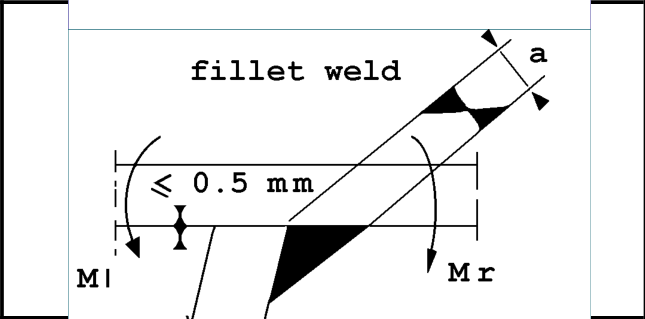
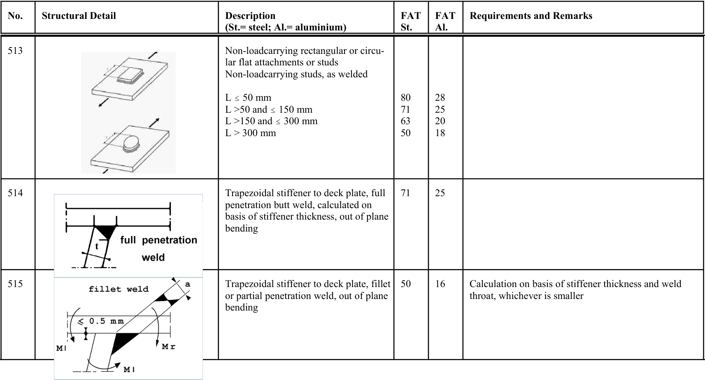

# IIW · 3.2-1 · dettaglio 515

[Pagina estratta](../pages/iiw-065.md) · [PDF originale](../../sources/iiw.pdf#page=65)

## Classificazione riportata

steel: 50; aluminium: 16

## Descrizione e condizioni

Trapezoidal stiffener to deck plate, fillet
or partial penetration weld, out of plane
bending

## Requisiti e note

Calculation on basis of stiffener thickness and weld
throat, whichever is smaller

> Estrazione documentale da verificare. Le categorie non sono valori di progetto pronti per il calcolo. Celle condivise e varianti non vanno separate dalle condizioni.

## Tabella completa

