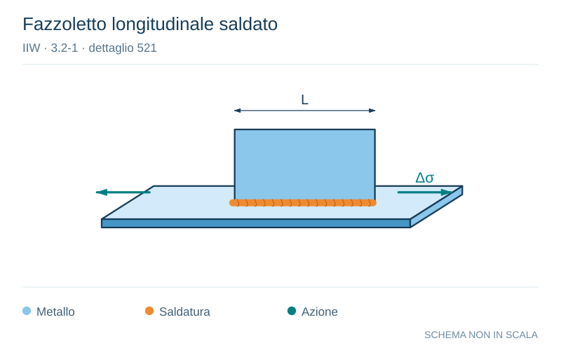

# IIW · 3.2-1 · dettaglio 521

[Pagina estratta](../pages/iiw-066.md) · [PDF originale](../../sources/iiw.pdf#page=66)

**Fazzoletto longitudinale saldato.** Disegno vettoriale non in scala. [Apri / scarica il disegno SVG](../../assets/illustrations/iiw-066-t01-d01.svg).

Il blu rappresenta gli elementi metallici, l’arancio le saldature e il turchese le azioni. Simboli e proporzioni hanno funzione schematica; classi, dimensioni limite e condizioni applicabili sono quelle riportate nella fonte.

## Classificazione riportata

steel: 80
71
63
50; aluminium: 28
25
20
18

## Descrizione e condizioni

Longitudinal fillet welded gusset at
length l
                          l < 50 mm
                          l < 150 mm
                          l < 300 mm
                          l > 300 mm

## Requisiti e note

For gusset near edge: see 525 "flat side gusset"

If attachement thickness < 1/2 of base plat thickness,
then one step higher allowed (not for welded on profi-
les!)

> Estrazione documentale da verificare. Le categorie non sono valori di progetto pronti per il calcolo. Celle condivise e varianti non vanno separate dalle condizioni.

## Contesto della classificazione

[Celle della tabella in Markdown](../tables/iiw-066-t01.md) · [Tabella nel PDF di riferimento](../../sources/iiw.pdf#page=66).
