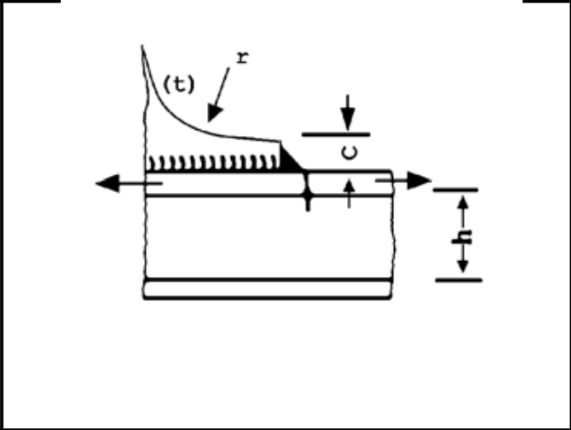
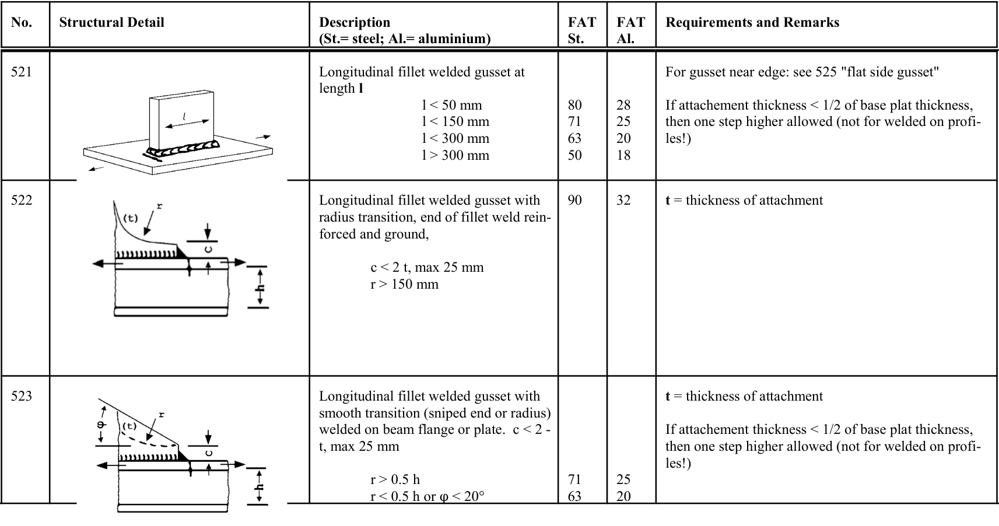

# IIW · 3.2-1 · dettaglio 522

[Pagina estratta](../pages/iiw-066.md) · [PDF originale](../../sources/iiw.pdf#page=66)

## Classificazione riportata

steel: 90; aluminium: 32

## Descrizione e condizioni

Longitudinal fillet welded gusset with
radius transition, end of fillet weld rein-
forced and ground,

        c < 2 t, max 25 mm
           r > 150 mm

## Requisiti e note

t = thickness of attachment

> Estrazione documentale da verificare. Le categorie non sono valori di progetto pronti per il calcolo. Celle condivise e varianti non vanno separate dalle condizioni.

## Tabella completa

