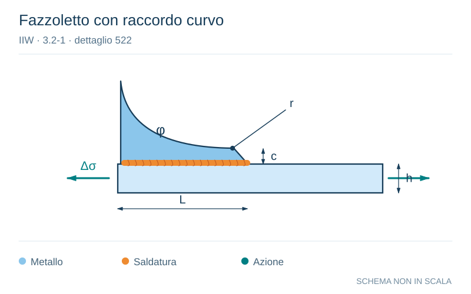

# IIW · 3.2-1 · dettaglio 522

[Pagina estratta](../pages/iiw-066.md) · [PDF originale](../../sources/iiw.pdf#page=66)

**Fazzoletto con raccordo curvo.** Disegno vettoriale non in scala. [Apri / scarica il disegno SVG](../../assets/illustrations/iiw-066-t01-d02.svg).

Il blu rappresenta gli elementi metallici, l’arancio le saldature e il turchese le azioni. Simboli e proporzioni hanno funzione schematica; classi, dimensioni limite e condizioni applicabili sono quelle riportate nella fonte.

## Classificazione riportata

steel: 90; aluminium: 32

## Descrizione e condizioni

Longitudinal fillet welded gusset with
radius transition, end of fillet weld rein-
forced and ground,

        c < 2 t, max 25 mm
           r > 150 mm

## Requisiti e note

t = thickness of attachment

> Estrazione documentale da verificare. Le categorie non sono valori di progetto pronti per il calcolo. Celle condivise e varianti non vanno separate dalle condizioni.

## Contesto della classificazione

[Celle della tabella in Markdown](../tables/iiw-066-t01.md) · [Tabella nel PDF di riferimento](../../sources/iiw.pdf#page=66).
