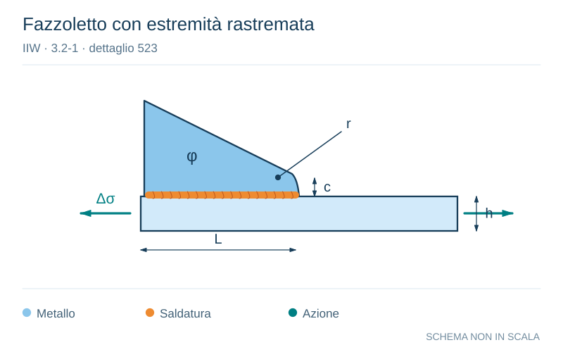

# IIW · 3.2-1 · dettaglio 523

[Pagina estratta](../pages/iiw-066.md) · [PDF originale](../../sources/iiw.pdf#page=66)

**Fazzoletto con estremità rastremata.** Disegno vettoriale non in scala. [Apri / scarica il disegno SVG](../../assets/illustrations/iiw-066-t01-d03.svg).

Il blu rappresenta gli elementi metallici, l’arancio le saldature e il turchese le azioni. Simboli e proporzioni hanno funzione schematica; classi, dimensioni limite e condizioni applicabili sono quelle riportate nella fonte.

## Classificazione riportata

steel: 71
63; aluminium: 25
20

## Descrizione e condizioni

Longitudinal fillet welded gusset with
smooth transition (sniped end or radius)
welded on beam flange or plate. c < 2 -
t, max 25 mm

           r > 0.5 h
           r < 0.5 h or n < 20°

## Requisiti e note

t = thickness of attachment

If attachement thickness < 1/2 of base plat thickness,
then one step higher allowed (not for welded on profi-
les!)

> Estrazione documentale da verificare. Le categorie non sono valori di progetto pronti per il calcolo. Celle condivise e varianti non vanno separate dalle condizioni.

## Contesto della classificazione

[Celle della tabella in Markdown](../tables/iiw-066-t01.md) · [Tabella nel PDF di riferimento](../../sources/iiw.pdf#page=66).
