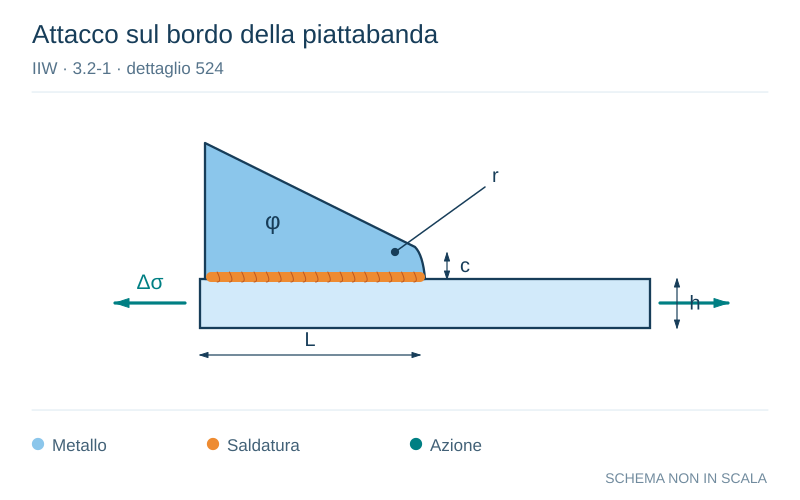

# IIW · 3.2-1 · dettaglio 524

[Pagina estratta](../pages/iiw-067.md) · [PDF originale](../../sources/iiw.pdf#page=67)

**Attacco sul bordo della piattabanda.** Disegno vettoriale non in scala. [Apri / scarica il disegno SVG](../../assets/illustrations/iiw-067-t01-d01.svg).

Il blu rappresenta gli elementi metallici, l’arancio le saldature e il turchese le azioni. Simboli e proporzioni hanno funzione schematica; classi, dimensioni limite e condizioni applicabili sono quelle riportate nella fonte.

## Classificazione riportata

steel: 50
45; aluminium: t = thickness of attachment

For t2 < 0.7 t1, FAT rises 12%

## Descrizione e condizioni

Longitudinal flat side gusset welded on
plate edge or beam flange edge, with
smooth transition (sniped end or radi-
us). c < 2t2, max. 25 mm

           r > 0.5 h
           r < 0.5 h or n < 20°

## Requisiti e note

> Estrazione documentale da verificare. Le categorie non sono valori di progetto pronti per il calcolo. Celle condivise e varianti non vanno separate dalle condizioni.

## Contesto della classificazione

[Celle della tabella in Markdown](../tables/iiw-067-t01.md) · [Tabella nel PDF di riferimento](../../sources/iiw.pdf#page=67).
