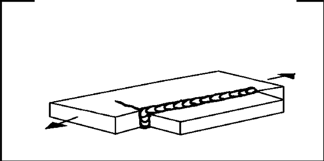

# IIW · 3.2-1 · dettaglio 525

[Pagina estratta](../pages/iiw-067.md) · [PDF originale](../../sources/iiw.pdf#page=67)

## Classificazione riportata

steel: 50
45
40; aluminium: For t2 < 0.7 t1, FAT rises 12%

## Descrizione e condizioni

Longitudinal flat side gusset welded on
plate or beam flange edge, gusset length
l:
                          l < 150 mm
                          l < 300 mm
                          l > 300 mm

## Requisiti e note

> Estrazione documentale da verificare. Le categorie non sono valori di progetto pronti per il calcolo. Celle condivise e varianti non vanno separate dalle condizioni.

## Tabella completa

