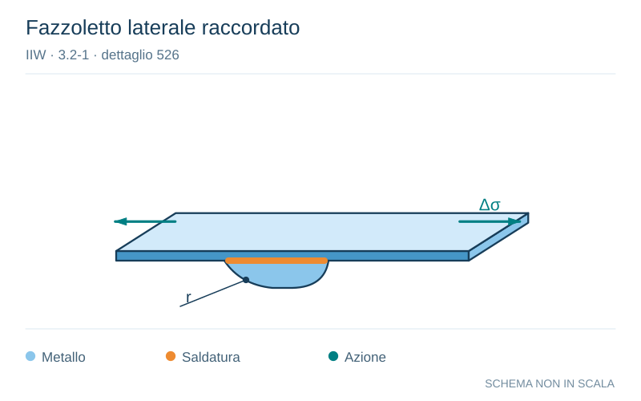

# IIW · 3.2-1 · dettaglio 526

[Pagina estratta](../pages/iiw-067.md) · [PDF originale](../../sources/iiw.pdf#page=67)

**Fazzoletto laterale raccordato.** Disegno vettoriale non in scala. [Apri / scarica il disegno SVG](../../assets/illustrations/iiw-067-t01-d03.svg).

Il blu rappresenta gli elementi metallici, l’arancio le saldature e il turchese le azioni. Simboli e proporzioni hanno funzione schematica; classi, dimensioni limite e condizioni applicabili sono quelle riportate nella fonte.

## Classificazione riportata

steel: 90
71
50; aluminium: Smooth transition radius formed by grinding the weld
area in transition in order to temove the weld toe com-
pletely. Grinding parallel to stress.

## Descrizione e condizioni

Longitudinal flat side gusset welded on
edge of plate or beam flange, radius
transition ground.
       r>150 or r/w > 1/3
        1/6 < r/w < 1/3
        r/w < 1/6

## Requisiti e note

> Estrazione documentale da verificare. Le categorie non sono valori di progetto pronti per il calcolo. Celle condivise e varianti non vanno separate dalle condizioni.

## Contesto della classificazione

[Celle della tabella in Markdown](../tables/iiw-067-t01.md) · [Tabella nel PDF di riferimento](../../sources/iiw.pdf#page=67).
