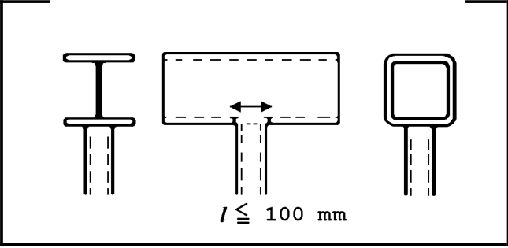

# IIW · 3.2-1 · dettaglio 531

[Pagina estratta](../pages/iiw-067.md) · [PDF originale](../../sources/iiw.pdf#page=67)

## Classificazione riportata

steel: 71; aluminium: Non load-carrying welds. Width parallel to stress direc-
tion < 100 mm.

## Descrizione e condizioni

Circular or rectangular hollow section,
fillet welded to another section. Section
width parallel to stress direction < 100
mm, else like longitudinal attachment

## Requisiti e note

> Estrazione documentale da verificare. Le categorie non sono valori di progetto pronti per il calcolo. Celle condivise e varianti non vanno separate dalle condizioni.

## Tabella completa

