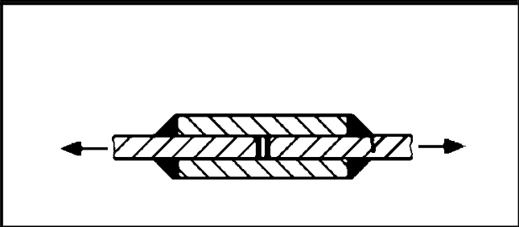

# IIW · 3.2-1 · dettaglio 611

[Pagina estratta](../pages/iiw-068.md) · [PDF originale](../../sources/iiw.pdf#page=68)

## Classificazione riportata

aluminium: 22
16; steel: 63
45

## Descrizione e condizioni

Transverse loaded lap joint with fillet
welds
        Fatigue of parent metal
        Fatigue of weld throat

## Requisiti e note

Stresses to be calculated in the main plate using a plate
width equalling the weld length.
Buckling avoided by loading or design!

> Estrazione documentale da verificare. Le categorie non sono valori di progetto pronti per il calcolo. Celle condivise e varianti non vanno separate dalle condizioni.

## Tabella completa

