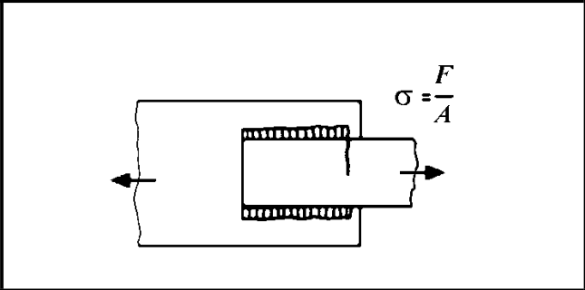

# IIW · 3.2-1 · dettaglio 612

[Pagina estratta](../pages/iiw-068.md) · [PDF originale](../../sources/iiw.pdf#page=68)

## Classificazione riportata

aluminium: 18

18; steel: 50

50

## Descrizione e condizioni

Longitudinally loaded lap joint with
side fillet welds
        Fatigue of parent metal
        Fatigue of weld (calc. on max.
       weld length of 40 times the
         throat of the weld

## Requisiti e note

Weld terminations more than 10 mm from plate edge.
Buckling avoided by loading or design!

For verification of parent metal, the higher stress of
both members has to be taken.

> Estrazione documentale da verificare. Le categorie non sono valori di progetto pronti per il calcolo. Celle condivise e varianti non vanno separate dalle condizioni.

## Tabella completa

