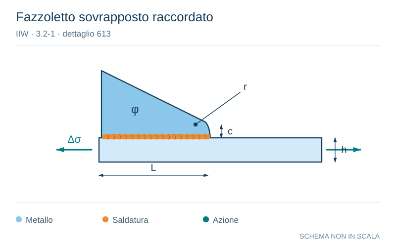

# IIW · 3.2-1 · dettaglio 613

[Pagina estratta](../pages/iiw-068.md) · [PDF originale](../../sources/iiw.pdf#page=68)

**Fazzoletto sovrapposto raccordato.** Disegno vettoriale non in scala. [Apri / scarica il disegno SVG](../../assets/illustrations/iiw-068-t01-d03.svg).

Il blu rappresenta gli elementi metallici, l’arancio le saldature e il turchese le azioni. Simboli e proporzioni hanno funzione schematica; classi, dimensioni limite e condizioni applicabili sono quelle riportate nella fonte.

## Classificazione riportata

aluminium: 22
20
18; steel: 63
56
50

## Descrizione e condizioni

Lap joint gusset, fillet welded, non-
load-carrying, with smooth transition
(sniped end with n<20° or radius),
welded to loaded element c<2At,
but c <= 25 mm
         to flat bar
         to bulb section
         to angle section

## Requisiti e note

t = thickness of gusset plate

> Estrazione documentale da verificare. Le categorie non sono valori di progetto pronti per il calcolo. Celle condivise e varianti non vanno separate dalle condizioni.

## Contesto della classificazione

[Celle della tabella in Markdown](../tables/iiw-068-t01.md) · [Tabella nel PDF di riferimento](../../sources/iiw.pdf#page=68).
