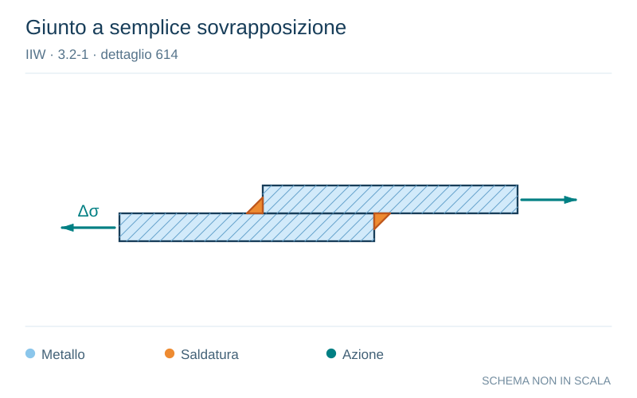

# IIW · 3.2-1 · dettaglio 614

[Pagina estratta](../pages/iiw-068.md) · [PDF originale](../../sources/iiw.pdf#page=68)

**Giunto a semplice sovrapposizione.** Disegno vettoriale non in scala. [Apri / scarica il disegno SVG](../../assets/illustrations/iiw-068-t01-d04.svg).

Il blu rappresenta gli elementi metallici, l’arancio le saldature e il turchese le azioni. Simboli e proporzioni hanno funzione schematica; classi, dimensioni limite e condizioni applicabili sono quelle riportate nella fonte.

## Classificazione riportata

aluminium: 22

12; steel: 63

36

## Descrizione e condizioni

Transverse loaded overlap joint with
fillet welds.
Stress in plate at weld toe (toe crack)

Stress in weld throat (root crack)

## Requisiti e note

Stresses to be calculated using a plate width equalling
the weld length.
For stress in plate, excenticity to be considered, as gi-
ven in chapters 3.8.2 and 6.3.
Both failure modes have to be assessed separately.

> Estrazione documentale da verificare. Le categorie non sono valori di progetto pronti per il calcolo. Celle condivise e varianti non vanno separate dalle condizioni.

## Contesto della classificazione

[Celle della tabella in Markdown](../tables/iiw-068-t01.md) · [Tabella nel PDF di riferimento](../../sources/iiw.pdf#page=68).
