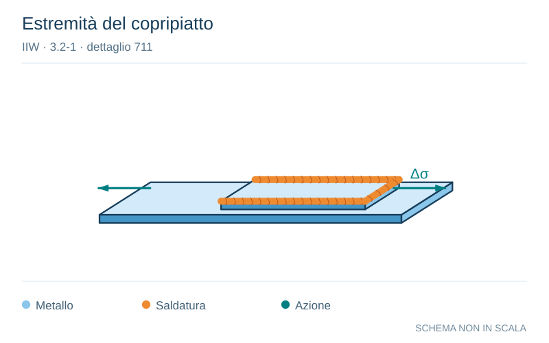

# IIW · 3.2-1 · dettaglio 711

[Pagina estratta](../pages/iiw-069.md) · [PDF originale](../../sources/iiw.pdf#page=69)

**Estremità del copripiatto.** Disegno vettoriale non in scala. [Apri / scarica il disegno SVG](../../assets/illustrations/iiw-069-t01-d01.svg).

Il blu rappresenta gli elementi metallici, l’arancio le saldature e il turchese le azioni. Simboli e proporzioni hanno funzione schematica; classi, dimensioni limite e condizioni applicabili sono quelle riportate nella fonte.

## Classificazione riportata

steel: 56
50
45; aluminium: 20
18
16

## Descrizione e condizioni

End of long doubling plate on I-beam,
welded ends (based on stress range in
flange at weld toe)
          tD # 0.8 t
         0.8 t < tD # 1.5 t
          tD > 1.5 t

## Requisiti e note

> Estrazione documentale da verificare. Le categorie non sono valori di progetto pronti per il calcolo. Celle condivise e varianti non vanno separate dalle condizioni.

## Contesto della classificazione

[Celle della tabella in Markdown](../tables/iiw-069-t01.md) · [Tabella nel PDF di riferimento](../../sources/iiw.pdf#page=69).
