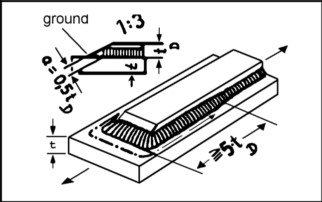
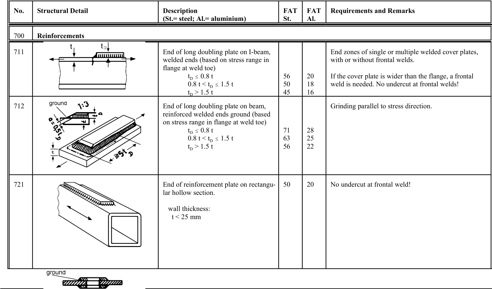

# IIW · 3.2-1 · dettaglio 712

[Pagina estratta](../pages/iiw-069.md) · [PDF originale](../../sources/iiw.pdf#page=69)

## Classificazione riportata

steel: 71
63
56; aluminium: 28
25
22

## Descrizione e condizioni

End of long doubling plate on beam,
reinforced welded ends ground (based
on stress range in flange at weld toe)
          tD # 0.8 t
         0.8 t < tD # 1.5 t
          tD > 1.5 t

## Requisiti e note

> Estrazione documentale da verificare. Le categorie non sono valori di progetto pronti per il calcolo. Celle condivise e varianti non vanno separate dalle condizioni.

## Tabella completa

