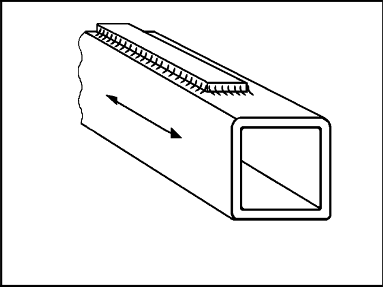

# IIW · 3.2-1 · dettaglio 721

[Pagina estratta](../pages/iiw-069.md) · [PDF originale](../../sources/iiw.pdf#page=69)

## Classificazione riportata

steel: 50; aluminium: 20

## Descrizione e condizioni

End of reinforcement plate on rectangu-
lar hollow section.

  wall thickness:
     t < 25 mm

## Requisiti e note

> Estrazione documentale da verificare. Le categorie non sono valori di progetto pronti per il calcolo. Celle condivise e varianti non vanno separate dalle condizioni.

## Tabella completa

