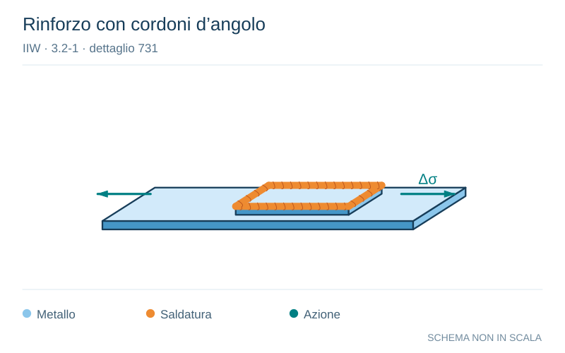

# IIW · 3.2-1 · dettaglio 731

[Pagina estratta](../pages/iiw-070.md) · [PDF originale](../../sources/iiw.pdf#page=70)

**Rinforzo con cordoni d’angolo.** Disegno vettoriale non in scala. [Apri / scarica il disegno SVG](../../assets/illustrations/iiw-070-t01-d01.svg).

> La cella del dettaglio nel PDF è priva di figura. Schema editoriale ricostruito dalla descrizione, non copia di una geometria normativa.

Il blu rappresenta gli elementi metallici, l’arancio le saldature e il turchese le azioni. Simboli e proporzioni hanno funzione schematica; classi, dimensioni limite e condizioni applicabili sono quelle riportate nella fonte.

## Classificazione riportata

steel: 80
71; aluminium: 32
25

## Descrizione e condizioni

Reinforcements welded on with fillet
welds, toe ground
Toe as welded

## Requisiti e note

Grinding in direction of stress!

Analysis based on modified nominal stress, however,
structural stress approach recommended.

> Estrazione documentale da verificare. Le categorie non sono valori di progetto pronti per il calcolo. Celle condivise e varianti non vanno separate dalle condizioni.

## Contesto della classificazione

[Celle della tabella in Markdown](../tables/iiw-070-t01.md) · [Tabella nel PDF di riferimento](../../sources/iiw.pdf#page=70).
