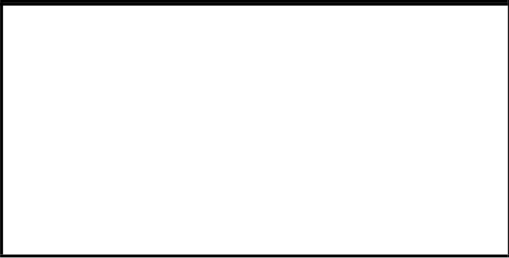

# IIW · 3.2-1 · dettaglio 731

[Pagina estratta](../pages/iiw-070.md) · [PDF originale](../../sources/iiw.pdf#page=70)

## Classificazione riportata

steel: 80
71; aluminium: 32
25

## Descrizione e condizioni

Reinforcements welded on with fillet
welds, toe ground
Toe as welded

## Requisiti e note

Grinding in direction of stress!

Analysis based on modified nominal stress, however,
structural stress approach recommended.

> Estrazione documentale da verificare. Le categorie non sono valori di progetto pronti per il calcolo. Celle condivise e varianti non vanno separate dalle condizioni.

## Tabella completa

