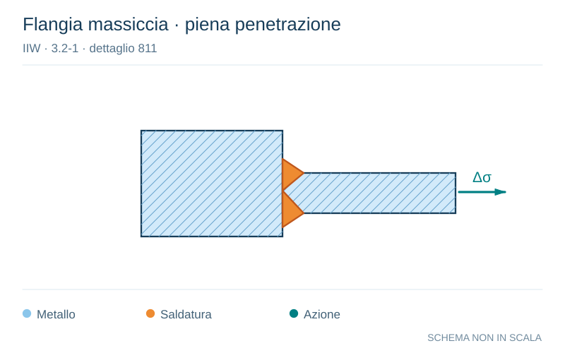

# IIW · 3.2-1 · dettaglio 811

[Pagina estratta](../pages/iiw-070.md) · [PDF originale](../../sources/iiw.pdf#page=70)

**Flangia massiccia · piena penetrazione.** Disegno vettoriale non in scala. [Apri / scarica il disegno SVG](../../assets/illustrations/iiw-070-t01-d02.svg).

Il blu rappresenta gli elementi metallici, l’arancio le saldature e il turchese le azioni. Simboli e proporzioni hanno funzione schematica; classi, dimensioni limite e condizioni applicabili sono quelle riportate nella fonte.

## Classificazione riportata

steel: 71; aluminium: 25

## Descrizione e condizioni

Stiff block flange, full penetration weld

## Requisiti e note

> Estrazione documentale da verificare. Le categorie non sono valori di progetto pronti per il calcolo. Celle condivise e varianti non vanno separate dalle condizioni.

## Contesto della classificazione

[Celle della tabella in Markdown](../tables/iiw-070-t01.md) · [Tabella nel PDF di riferimento](../../sources/iiw.pdf#page=70).
