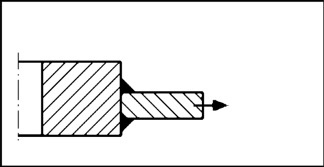
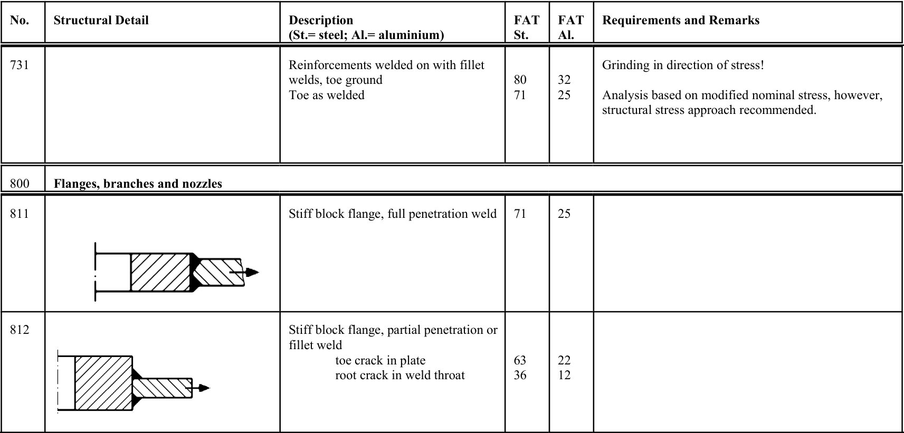

# IIW · 3.2-1 · dettaglio 812

[Pagina estratta](../pages/iiw-070.md) · [PDF originale](../../sources/iiw.pdf#page=70)

## Classificazione riportata

steel: 63
36; aluminium: 22
12

## Descrizione e condizioni

Stiff block flange, partial penetration or
fillet weld
         toe crack in plate
         root crack in weld throat

## Requisiti e note

> Estrazione documentale da verificare. Le categorie non sono valori di progetto pronti per il calcolo. Celle condivise e varianti non vanno separate dalle condizioni.

## Tabella completa

