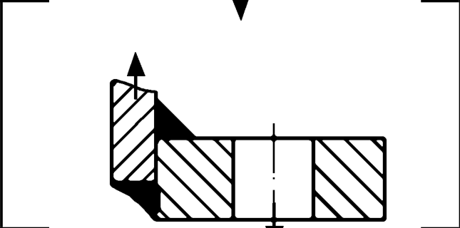

# IIW · 3.2-1 · dettaglio 822

[Pagina estratta](../pages/iiw-071.md) · [PDF originale](../../sources/iiw.pdf#page=71)

## Classificazione riportata

steel: 63; aluminium: 22

## Descrizione e condizioni

Flat flange with fillet welds, modified
nominal stress in pipe, toe crack.

## Requisiti e note

Assessment by structural hot spot is recommended.

> Estrazione documentale da verificare. Le categorie non sono valori di progetto pronti per il calcolo. Celle condivise e varianti non vanno separate dalle condizioni.

## Tabella completa

