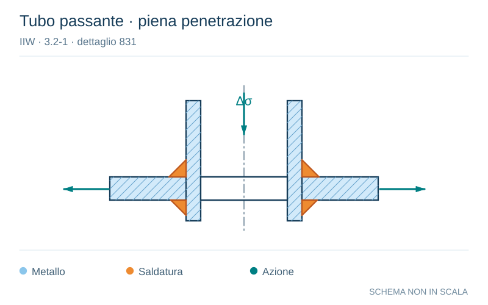

# IIW · 3.2-1 · dettaglio 831

[Pagina estratta](../pages/iiw-071.md) · [PDF originale](../../sources/iiw.pdf#page=71)

**Tubo passante · piena penetrazione.** Disegno vettoriale non in scala. [Apri / scarica il disegno SVG](../../assets/illustrations/iiw-071-t01-d03.svg).

Il blu rappresenta gli elementi metallici, l’arancio le saldature e il turchese le azioni. Simboli e proporzioni hanno funzione schematica; classi, dimensioni limite e condizioni applicabili sono quelle riportate nella fonte.

## Classificazione riportata

steel: 80; aluminium: 28

## Descrizione e condizioni

Tubular branch or pipe penetrating a
plate, K-butt welds.

## Requisiti e note

If diameter > 50 mm, stress concentration of cutout has
to be considered

Assessment by structural hot spot is recommended.

> Estrazione documentale da verificare. Le categorie non sono valori di progetto pronti per il calcolo. Celle condivise e varianti non vanno separate dalle condizioni.

## Contesto della classificazione

[Celle della tabella in Markdown](../tables/iiw-071-t01.md) · [Tabella nel PDF di riferimento](../../sources/iiw.pdf#page=71).
