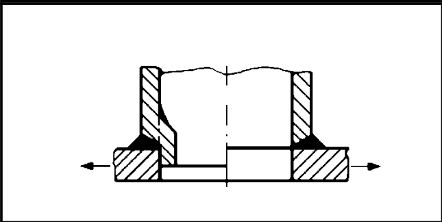

# IIW · 3.2-1 · dettaglio 841

[Pagina estratta](../pages/iiw-072.md) · [PDF originale](../../sources/iiw.pdf#page=72)

## Classificazione riportata

steel: 71; aluminium: 25

## Descrizione e condizioni

Nozzle welded on plate, root pass re-
moved by drilling.

## Requisiti e note

If diameter > 50 mm, stress concentration of cutout has
to be considered

Assessment by structural hot spot is recommended.

> Estrazione documentale da verificare. Le categorie non sono valori di progetto pronti per il calcolo. Celle condivise e varianti non vanno separate dalle condizioni.

## Tabella completa

