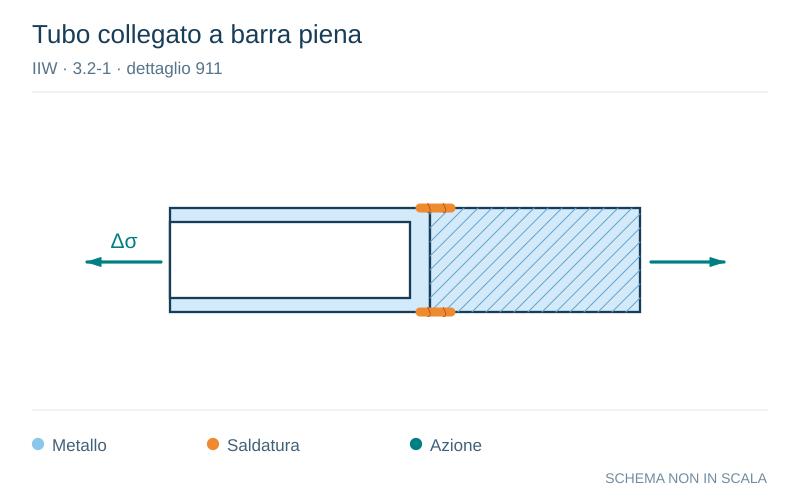

# IIW · 3.2-1 · dettaglio 911

[Pagina estratta](../pages/iiw-072.md) · [PDF originale](../../sources/iiw.pdf#page=72)

**Tubo collegato a barra piena.** Disegno vettoriale non in scala. [Apri / scarica il disegno SVG](../../assets/illustrations/iiw-072-t01-d03.svg).

Il blu rappresenta gli elementi metallici, l’arancio le saldature e il turchese le azioni. Simboli e proporzioni hanno funzione schematica; classi, dimensioni limite e condizioni applicabili sono quelle riportate nella fonte.

## Classificazione riportata

steel: 63; aluminium: 22

## Descrizione e condizioni

Circular hollow section butt joint to
massive bar, as welded

## Requisiti e note

Root of weld has to penetrate into the massive bar in
order to avoid a gap perpenticular to the stress directi-
on.

> Estrazione documentale da verificare. Le categorie non sono valori di progetto pronti per il calcolo. Celle condivise e varianti non vanno separate dalle condizioni.

## Contesto della classificazione

[Celle della tabella in Markdown](../tables/iiw-072-t01.md) · [Tabella nel PDF di riferimento](../../sources/iiw.pdf#page=72).
