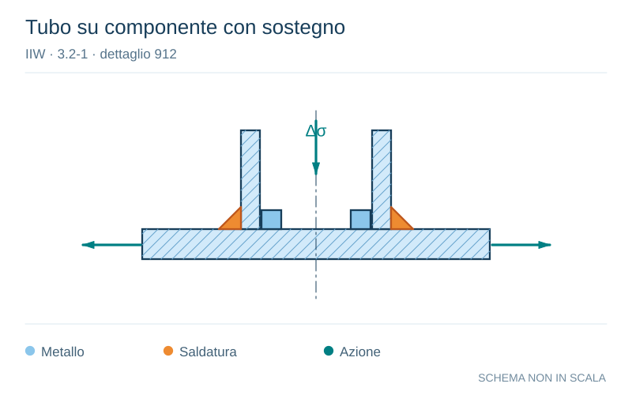

# IIW · 3.2-1 · dettaglio 912

[Pagina estratta](../pages/iiw-073.md) · [PDF originale](../../sources/iiw.pdf#page=73)

**Tubo su componente con sostegno.** Disegno vettoriale non in scala. [Apri / scarica il disegno SVG](../../assets/illustrations/iiw-073-t01-d01.svg).

> La cella del dettaglio nel PDF è priva di figura. Schema editoriale ricostruito dalla descrizione, non copia di una geometria normativa.

Il blu rappresenta gli elementi metallici, l’arancio le saldature e il turchese le azioni. Simboli e proporzioni hanno funzione schematica; classi, dimensioni limite e condizioni applicabili sono quelle riportate nella fonte.

## Classificazione riportata

steel: 63; aluminium: 22

## Descrizione e condizioni

Circular hollow section welded to com-
ponent with single side butt weld, ba-
cking provided.
Root crack.

## Requisiti e note

Root of weld has to penetrate into the backing area in
order to avoid a gap perpenticular to the stress directi-
on.

> Estrazione documentale da verificare. Le categorie non sono valori di progetto pronti per il calcolo. Celle condivise e varianti non vanno separate dalle condizioni.

## Contesto della classificazione

[Celle della tabella in Markdown](../tables/iiw-073-t01.md) · [Tabella nel PDF di riferimento](../../sources/iiw.pdf#page=73).
