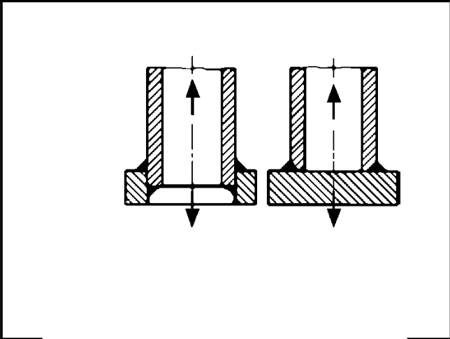

# IIW · 3.2-1 · dettaglio 913

[Pagina estratta](../pages/iiw-073.md) · [PDF originale](../../sources/iiw.pdf#page=73)

## Classificazione riportata

steel: 50; aluminium: 18

## Descrizione e condizioni

Circular hollow section welded to com-
ponent single sided butt weld or double
fillet welds.
Root crack.

## Requisiti e note

Impairment of inspection of root cracks by NDT may
be compensated by adequate safety considerations (see
chapter 5) or by downgrading down to 2 FAT classes.

> Estrazione documentale da verificare. Le categorie non sono valori di progetto pronti per il calcolo. Celle condivise e varianti non vanno separate dalle condizioni.

## Tabella completa

