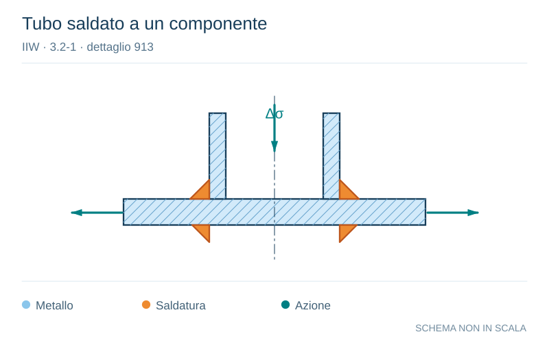

# IIW · 3.2-1 · dettaglio 913

[Pagina estratta](../pages/iiw-073.md) · [PDF originale](../../sources/iiw.pdf#page=73)

**Tubo saldato a un componente.** Disegno vettoriale non in scala. [Apri / scarica il disegno SVG](../../assets/illustrations/iiw-073-t01-d02.svg).

Il blu rappresenta gli elementi metallici, l’arancio le saldature e il turchese le azioni. Simboli e proporzioni hanno funzione schematica; classi, dimensioni limite e condizioni applicabili sono quelle riportate nella fonte.

## Classificazione riportata

steel: 50; aluminium: 18

## Descrizione e condizioni

Circular hollow section welded to com-
ponent single sided butt weld or double
fillet welds.
Root crack.

## Requisiti e note

Impairment of inspection of root cracks by NDT may
be compensated by adequate safety considerations (see
chapter 5) or by downgrading down to 2 FAT classes.

> Estrazione documentale da verificare. Le categorie non sono valori di progetto pronti per il calcolo. Celle condivise e varianti non vanno separate dalle condizioni.

## Contesto della classificazione

[Celle della tabella in Markdown](../tables/iiw-073-t01.md) · [Tabella nel PDF di riferimento](../../sources/iiw.pdf#page=73).
