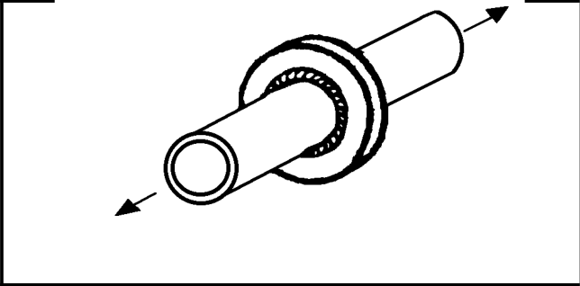
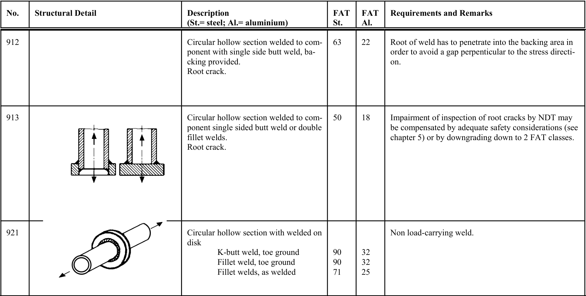

# IIW · 3.2-1 · dettaglio 921

[Pagina estratta](../pages/iiw-073.md) · [PDF originale](../../sources/iiw.pdf#page=73)

## Classificazione riportata

steel: 90
90
71; aluminium: 32
32
25

## Descrizione e condizioni

Circular hollow section with welded on
disk
        K-butt weld, toe ground
          Fillet weld, toe ground
          Fillet welds, as welded

## Requisiti e note

Non load-carrying weld.

> Estrazione documentale da verificare. Le categorie non sono valori di progetto pronti per il calcolo. Celle condivise e varianti non vanno separate dalle condizioni.

## Tabella completa

