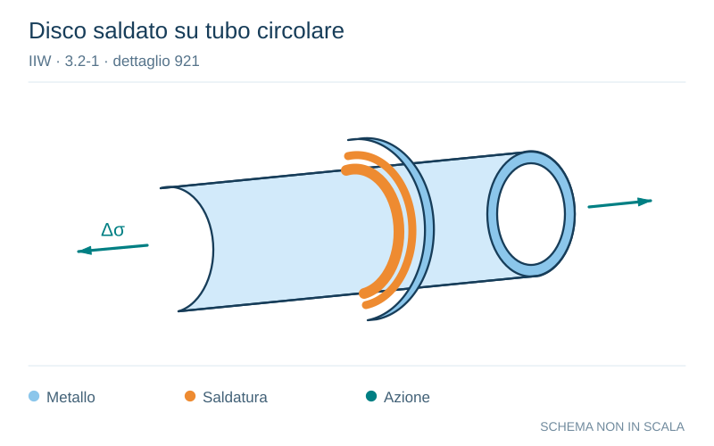

# IIW · 3.2-1 · dettaglio 921

[Pagina estratta](../pages/iiw-073.md) · [PDF originale](../../sources/iiw.pdf#page=73)

**Disco saldato su tubo circolare.** Disegno vettoriale non in scala. [Apri / scarica il disegno SVG](../../assets/illustrations/iiw-073-t01-d03.svg).

Il blu rappresenta gli elementi metallici, l’arancio le saldature e il turchese le azioni. Simboli e proporzioni hanno funzione schematica; classi, dimensioni limite e condizioni applicabili sono quelle riportate nella fonte.

## Classificazione riportata

steel: 90
90
71; aluminium: 32
32
25

## Descrizione e condizioni

Circular hollow section with welded on
disk
        K-butt weld, toe ground
          Fillet weld, toe ground
          Fillet welds, as welded

## Requisiti e note

Non load-carrying weld.

> Estrazione documentale da verificare. Le categorie non sono valori di progetto pronti per il calcolo. Celle condivise e varianti non vanno separate dalle condizioni.

## Contesto della classificazione

[Celle della tabella in Markdown](../tables/iiw-073-t01.md) · [Tabella nel PDF di riferimento](../../sources/iiw.pdf#page=73).
