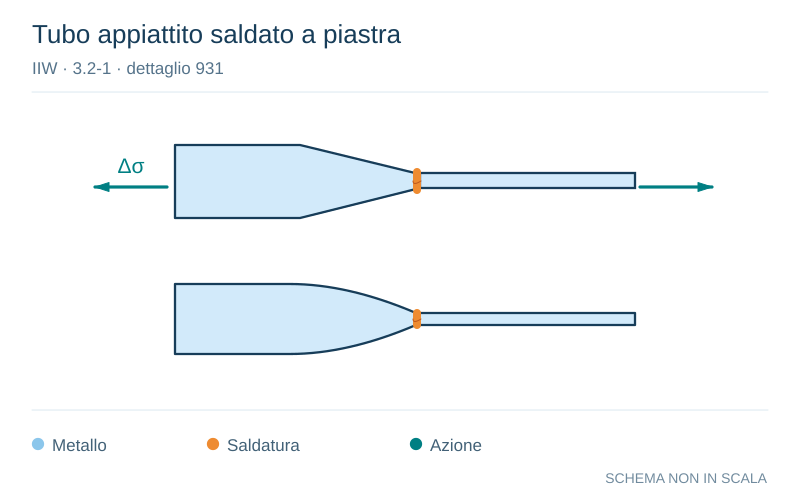

# IIW · 3.2-1 · dettaglio 931

[Pagina estratta](../pages/iiw-074.md) · [PDF originale](../../sources/iiw.pdf#page=74)

**Tubo appiattito saldato a piastra.** Disegno vettoriale non in scala. [Apri / scarica il disegno SVG](../../assets/illustrations/iiw-074-t01-d01.svg).

Il blu rappresenta gli elementi metallici, l’arancio le saldature e il turchese le azioni. Simboli e proporzioni hanno funzione schematica; classi, dimensioni limite e condizioni applicabili sono quelle riportate nella fonte.

## Classificazione riportata

steel: 62; aluminium: 18

## Descrizione e condizioni

Tube-plate joint, tubes flattened, butt
weld (X-groove)

 Tube diameter < 200 mm and
 plate thickness < 20 mm

## Requisiti e note

> Estrazione documentale da verificare. Le categorie non sono valori di progetto pronti per il calcolo. Celle condivise e varianti non vanno separate dalle condizioni.

## Contesto della classificazione

[Celle della tabella in Markdown](../tables/iiw-074-t01.md) · [Tabella nel PDF di riferimento](../../sources/iiw.pdf#page=74).
