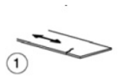
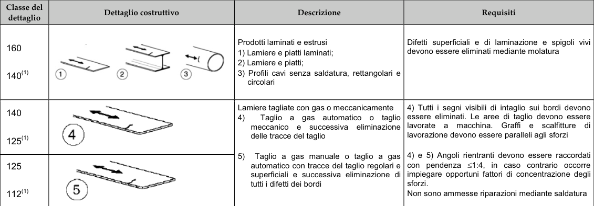

# NTC · C4.2.XII.a · dettaglio 1

[Pagina estratta](../pages/ntc-127.md) · [PDF originale](../../sources/ntc.pdf#page=127)

## Classificazione riportata

160
140(1)

## Descrizione e condizioni

Prodotti laminati e estrusi
1) Lamiere e piatti laminati;
2) Lamiere e piatti;
3) Profili cavi senza saldatura, rettangolari e
circolari

## Requisiti e note

Difetti superficiali e di laminazione e spigoli vivi
devono essere eliminati mediante molatura

> Estrazione documentale da verificare. Le categorie non sono valori di progetto pronti per il calcolo. Celle condivise e varianti non vanno separate dalle condizioni.

## Tabella completa

