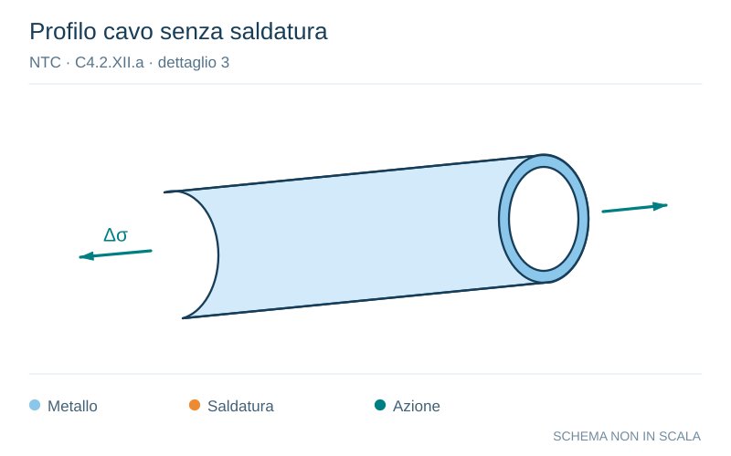

# NTC · C4.2.XII.a · dettaglio 3

[Pagina estratta](../pages/ntc-127.md) · [PDF originale](../../sources/ntc.pdf#page=127)

**Profilo cavo senza saldatura.** Disegno vettoriale non in scala. [Apri / scarica il disegno SVG](../../assets/illustrations/ntc-127-t01-d01-03.svg).

Il blu rappresenta gli elementi metallici, l’arancio le saldature e il turchese le azioni. Simboli e proporzioni hanno funzione schematica; classi, dimensioni limite e condizioni applicabili sono quelle riportate nella fonte.

## Classificazione riportata

160
140(1)

## Descrizione e condizioni

Prodotti laminati e estrusi
1) Lamiere e piatti laminati;
2) Lamiere e piatti;
3) Profili cavi senza saldatura, rettangolari e
circolari

## Requisiti e note

Difetti superficiali e di laminazione e spigoli vivi
devono essere eliminati mediante molatura

> Estrazione documentale da verificare. Le categorie non sono valori di progetto pronti per il calcolo. Celle condivise e varianti non vanno separate dalle condizioni.

## Contesto della classificazione

[Celle della tabella in Markdown](../tables/ntc-127-t01.md) · [Tabella nel PDF di riferimento](../../sources/ntc.pdf#page=127).
