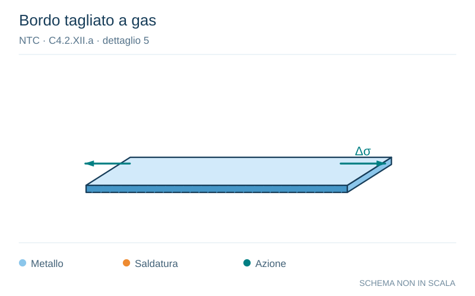

# NTC · C4.2.XII.a · dettaglio 5

[Pagina estratta](../pages/ntc-127.md) · [PDF originale](../../sources/ntc.pdf#page=127)

**Bordo tagliato a gas.** Disegno vettoriale non in scala. [Apri / scarica il disegno SVG](../../assets/illustrations/ntc-127-t01-d03.svg).

Il blu rappresenta gli elementi metallici, l’arancio le saldature e il turchese le azioni. Simboli e proporzioni hanno funzione schematica; classi, dimensioni limite e condizioni applicabili sono quelle riportate nella fonte.

## Classificazione riportata

125
112(1)

## Descrizione e condizioni

Lamiere tagliate con gas o meccanicamente
4)
Taglio a gas automatico o taglio
meccanico e successiva eliminazione
delle tracce del taglio
5) Taglio a gas manuale o taglio a gas
automatico con tracce del taglio regolari e
superficiali e successiva eliminazione di
tutti i difetti dei bordi

## Requisiti e note

4) Tutti i segni visibili di intaglio sui bordi devono
essere eliminati. Le aree di taglio devono essere
lavorate a macchina. Graffi e scalfitture di
lavorazione devono essere paralleli agli sforzi
4) e 5) Angoli rientranti devono essere raccordati
con pendenza ≤1:4, in caso contrario occorre
impiegare opportuni fattori di concentrazione degli
sforzi.
Non sono ammesse riparazioni mediante saldatura

> Estrazione documentale da verificare. Le categorie non sono valori di progetto pronti per il calcolo. Celle condivise e varianti non vanno separate dalle condizioni.

## Contesto della classificazione

[Celle della tabella in Markdown](../tables/ntc-127-t01.md) · [Tabella nel PDF di riferimento](../../sources/ntc.pdf#page=127).
