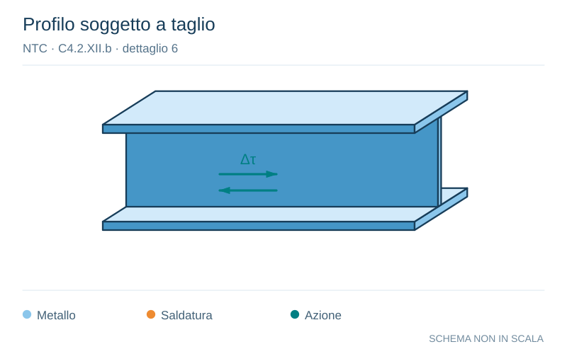

# NTC · C4.2.XII.b · dettaglio 6

[Pagina estratta](../pages/ntc-127.md) · [PDF originale](../../sources/ntc.pdf#page=127)

**Profilo soggetto a taglio.** Disegno vettoriale non in scala. [Apri / scarica il disegno SVG](../../assets/illustrations/ntc-127-t02-d01-01.svg).

Il blu rappresenta gli elementi metallici, l’arancio le saldature e il turchese le azioni. Simboli e proporzioni hanno funzione schematica; classi, dimensioni limite e condizioni applicabili sono quelle riportate nella fonte.

## Classificazione riportata

100

## Descrizione e condizioni

6) e 7) Prodotti laminati e estrusi (come quelli
di tabella C4.2.XVI.a) soggetti a tensioni
tangenziali

## Requisiti e note

Δτ calcolati con
∆V·S(t)
∆τ =
I·t

> Estrazione documentale da verificare. Le categorie non sono valori di progetto pronti per il calcolo. Celle condivise e varianti non vanno separate dalle condizioni.

## Contesto della classificazione

[Celle della tabella in Markdown](../tables/ntc-127-t02.md) · [Tabella nel PDF di riferimento](../../sources/ntc.pdf#page=127).
