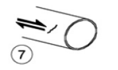
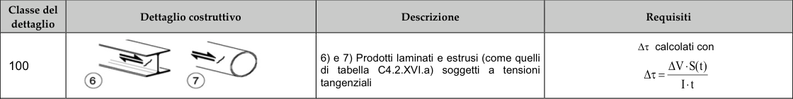

# NTC · C4.2.XII.b · dettaglio 7

[Pagina estratta](../pages/ntc-127.md) · [PDF originale](../../sources/ntc.pdf#page=127)

## Classificazione riportata

100

## Descrizione e condizioni

6) e 7) Prodotti laminati e estrusi (come quelli
di tabella C4.2.XVI.a) soggetti a tensioni
tangenziali

## Requisiti e note

Δτ calcolati con
∆V·S(t)
∆τ =
I·t

> Estrazione documentale da verificare. Le categorie non sono valori di progetto pronti per il calcolo. Celle condivise e varianti non vanno separate dalle condizioni.

## Tabella completa

