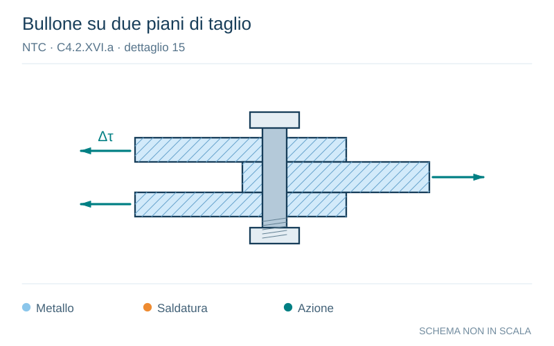

# NTC · C4.2.XVI.a · dettaglio 15

[Pagina estratta](../pages/ntc-127.md) · [PDF originale](../../sources/ntc.pdf#page=127)

**Bullone su due piani di taglio.** Disegno vettoriale non in scala. [Apri / scarica il disegno SVG](../../assets/illustrations/ntc-127-t03-d01.svg).

Il blu rappresenta gli elementi metallici, l’arancio le saldature e il turchese le azioni. Simboli e proporzioni hanno funzione schematica; classi, dimensioni limite e condizioni applicabili sono quelle riportate nella fonte.

## Classificazione riportata

100

## Descrizione e condizioni

15) Bulloni sollecitati a taglio su uno o due
piani non interessanti la parte filettata.
- Bulloni calibrati
- Bulloni normali di grado 5.6, 8.8 e 10.9 e
assenza di inversioni di carico

## Requisiti e note

∆τ calcolati in riferimento all'area del gambo

> Estrazione documentale da verificare. Le categorie non sono valori di progetto pronti per il calcolo. Celle condivise e varianti non vanno separate dalle condizioni.

## Contesto della classificazione

[Celle della tabella in Markdown](../tables/ntc-127-t03.md) · [Tabella nel PDF di riferimento](../../sources/ntc.pdf#page=127).
