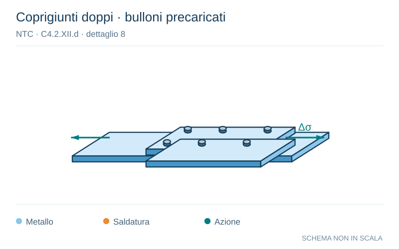

# NTC · C4.2.XII.d · dettaglio 8

[Pagina estratta](../pages/ntc-127.md) · [PDF originale](../../sources/ntc.pdf#page=127)

**Coprigiunti doppi · bulloni precaricati.** Disegno vettoriale non in scala. [Apri / scarica il disegno SVG](../../assets/illustrations/ntc-127-t04-d01.svg).

Il blu rappresenta gli elementi metallici, l’arancio le saldature e il turchese le azioni. Simboli e proporzioni hanno funzione schematica; classi, dimensioni limite e condizioni applicabili sono quelle riportate nella fonte.

## Classificazione riportata

112

## Descrizione e condizioni

Giunti bullonati con coprigiunti doppi e
8)
bulloni AR precaricati o bulloni precaricati
iniettati

## Requisiti e note

∆σ riferiti alla sezione lorda

> Estrazione documentale da verificare. Le categorie non sono valori di progetto pronti per il calcolo. Celle condivise e varianti non vanno separate dalle condizioni.

## Contesto della classificazione

[Celle della tabella in Markdown](../tables/ntc-127-t04.md) · [Tabella nel PDF di riferimento](../../sources/ntc.pdf#page=127).
