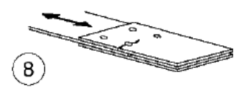

# NTC · C4.2.XII.d · dettaglio 8

[Pagina estratta](../pages/ntc-127.md) · [PDF originale](../../sources/ntc.pdf#page=127)

## Classificazione riportata

112

## Descrizione e condizioni

Giunti bullonati con coprigiunti doppi e
8)
bulloni AR precaricati o bulloni precaricati
iniettati

## Requisiti e note

∆σ riferiti alla sezione lorda

> Estrazione documentale da verificare. Le categorie non sono valori di progetto pronti per il calcolo. Celle condivise e varianti non vanno separate dalle condizioni.

## Tabella completa

