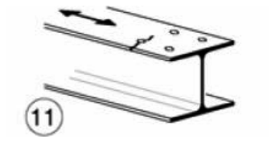
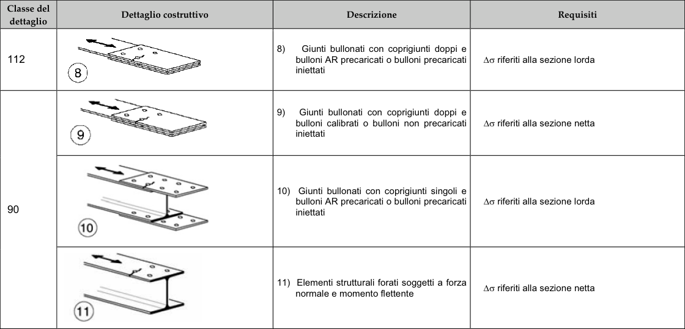

# NTC · C4.2.XII.d · dettaglio 11

[Pagina estratta](../pages/ntc-127.md) · [PDF originale](../../sources/ntc.pdf#page=127)

## Classificazione riportata

90

## Descrizione e condizioni

11) Elementi strutturali forati soggetti a forza
normale e momento flettente

## Requisiti e note

∆σ riferiti alla sezione netta

> Estrazione documentale da verificare. Le categorie non sono valori di progetto pronti per il calcolo. Celle condivise e varianti non vanno separate dalle condizioni.

## Tabella completa

