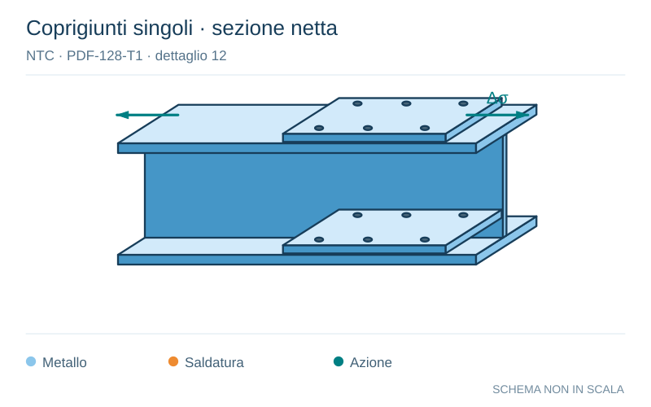

# NTC · PDF-128-T1 · dettaglio 12

[Pagina estratta](../pages/ntc-128.md) · [PDF originale](../../sources/ntc.pdf#page=128)

**Coprigiunti singoli · sezione netta.** Disegno vettoriale non in scala. [Apri / scarica il disegno SVG](../../assets/illustrations/ntc-128-t01-d01.svg).

Il blu rappresenta gli elementi metallici, l’arancio le saldature e il turchese le azioni. Simboli e proporzioni hanno funzione schematica; classi, dimensioni limite e condizioni applicabili sono quelle riportate nella fonte.

## Classificazione riportata

80

## Descrizione e condizioni

12) Giunti bullonati con coprigiunti singoli e
bulloni calibrati o bulloni non precaricati
iniettati

## Requisiti e note

Δσ riferiti alla sezione netta

> Estrazione documentale da verificare. Le categorie non sono valori di progetto pronti per il calcolo. Celle condivise e varianti non vanno separate dalle condizioni.

## Contesto della classificazione

[Celle della tabella in Markdown](../tables/ntc-128-t01.md) · [Tabella nel PDF di riferimento](../../sources/ntc.pdf#page=128).
