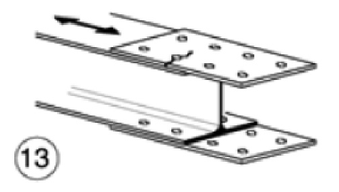
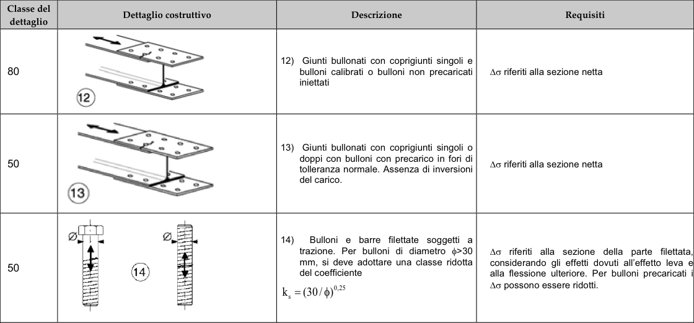

# NTC · PDF-128-T1 · dettaglio 13

[Pagina estratta](../pages/ntc-128.md) · [PDF originale](../../sources/ntc.pdf#page=128)

## Classificazione riportata

50

## Descrizione e condizioni

13) Giunti bullonati con coprigiunti singoli o
doppi con bulloni con precarico in fori di
tolieranza normale. Assenza di inversioni
del carico.

## Requisiti e note

∆σ riferiti alla sezione netta

> Estrazione documentale da verificare. Le categorie non sono valori di progetto pronti per il calcolo. Celle condivise e varianti non vanno separate dalle condizioni.

## Tabella completa

