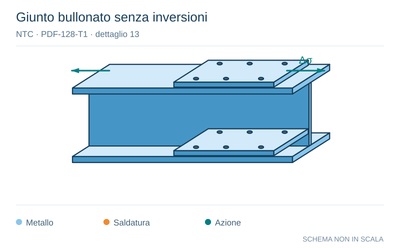

# NTC · PDF-128-T1 · dettaglio 13

[Pagina estratta](../pages/ntc-128.md) · [PDF originale](../../sources/ntc.pdf#page=128)

**Giunto bullonato senza inversioni.** Disegno vettoriale non in scala. [Apri / scarica il disegno SVG](../../assets/illustrations/ntc-128-t01-d02.svg).

Il blu rappresenta gli elementi metallici, l’arancio le saldature e il turchese le azioni. Simboli e proporzioni hanno funzione schematica; classi, dimensioni limite e condizioni applicabili sono quelle riportate nella fonte.

## Classificazione riportata

50

## Descrizione e condizioni

13) Giunti bullonati con coprigiunti singoli o
doppi con bulloni con precarico in fori di
tolieranza normale. Assenza di inversioni
del carico.

## Requisiti e note

∆σ riferiti alla sezione netta

> Estrazione documentale da verificare. Le categorie non sono valori di progetto pronti per il calcolo. Celle condivise e varianti non vanno separate dalle condizioni.

## Contesto della classificazione

[Celle della tabella in Markdown](../tables/ntc-128-t01.md) · [Tabella nel PDF di riferimento](../../sources/ntc.pdf#page=128).
