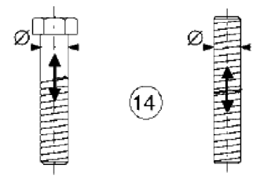

# NTC · PDF-128-T1 · dettaglio 14

[Pagina estratta](../pages/ntc-128.md) · [PDF originale](../../sources/ntc.pdf#page=128)

## Classificazione riportata

50

## Descrizione e condizioni

14)
Bulloni e barre filettate soggetti a
trazione. Per bulloni di diametro φ>30
mm, si deve adottare una classe ridotta
del coefficiente
ks = (30/φ)0,25

## Requisiti e note

∆σ riferiti alla sezione della parte filettata,
considerando gli effetti dovuti all'effetto leva el
alla flessione ulteriore. Per bulloni precaricati
∆σ possono essere ridotti.

> Estrazione documentale da verificare. Le categorie non sono valori di progetto pronti per il calcolo. Celle condivise e varianti non vanno separate dalle condizioni.

## Tabella completa

